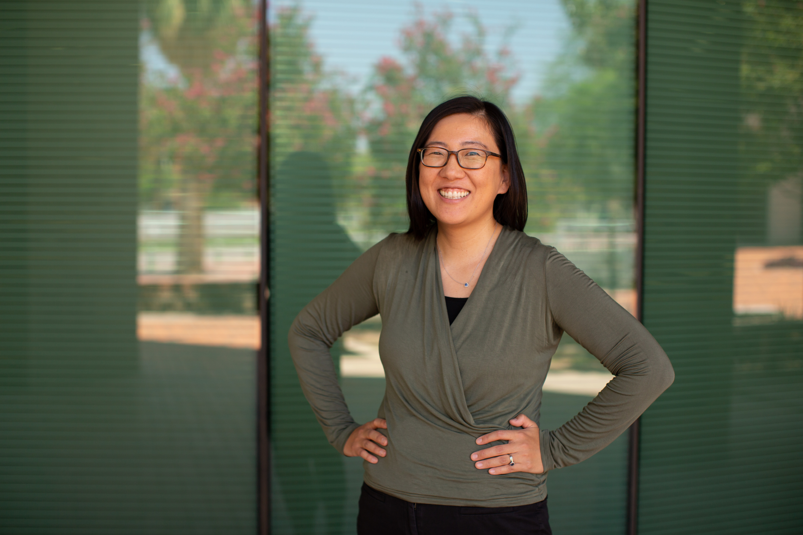

## Hello!

My name is Jung Mee Park. I am a Data Librarian at Wichita State University. Previously, I worked as a Young Adult Librarian with the Pima County Public Library. Previously, I worked as a data analyst at the University of Arizona. Within UA's University Information Technology Services's CRM division (Trellis), I was on the Data Strategy and Quality Team.

Some of the tools I use regularly include Salesforce, R, Python, SQL, and Tableau.

## Education

-   **MLIS** in Library and Information Sciences, **University of Arizona**
-   **PhD** in Sociology, **Cornell University**
-   **MA** in Quantitative Methods in the Social Sciences, **Columbia University**
-   **BA** (*magna cum laude*) in History and Sociology, minor in music **University of Pennsylvania**

## Recent Work Experience
-   1/4/2026 to present **Data Librarian** at the **Wichita State University**
-   1/13/2025 to 1/2/2026 **Librarian I** at the **Pima County Public Library**
-   7/28/2021 to 10/31/2024 **Data Analyst III** at the **University of Arizona, University Information and Technology Services**
-   7/1/2016 to 7/14/2021 **College Counselor** at **BASIS Tucson North**
-   5/2021-8/2021 **Discovery and Usability Intern** at the **University of Arizona, University Libraries**

### Connect with me on [LinkedIn](https://www.linkedin.com/in/jmp243/)
